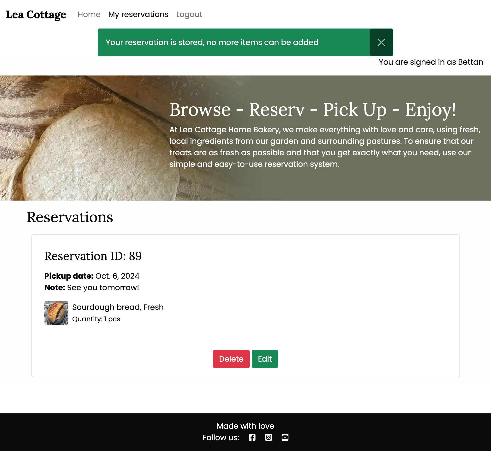

# Lea Cottage Django Project

## Overview

`lea_cottage` is a Django-based web application designed for managing a home bakery business. It provides a system for managing products, including ingredients and stock items, and allows users to reserve items for collection. The project includes two primary apps:

1. **Product**: Manages ingredients, stock items, and other product-related details.
2. **Reservation**: Handles the reservation process for users, including adding items to reservations and managing reservation statuses.

## UI/UX Design
### Overall Design Approach

The design of the site embraces the Swedish principle of **"less is more"** to deliver a clean, simple, and functional interface. The focus is on clarity and ease of use, avoiding unnecessary visual distractions or clutter. The result is a minimalistic layout that supports the primary goals of the home bakery business: providing a streamlined experience for users to browse products and make reservations without being overwhelmed by excessive features or complex navigation.

The design ensures that every element on the site serves a clear purpose, reflecting a calm and intentional user experience. The emphasis on simplicity allows users to focus on key tasks—browsing, selecting, and reserving items—without being distracted by unnecessary visual or interactive components.

### Agile Development

This project was developed using the **agile methodology**, from initial planning to final development. The process was visualized using GitHub Projects, where tasks were broken down into user stories and manageable chunks. A **Kanban board** was used to track the progress of each user story, ensuring the project stayed on track.

Each user story was tagged with labels to indicate its priority and significance within the overall scope of the project. The goal was to maintain a high level of focus on the most important features while remaining flexible enough to adapt to changes or improvements along the way.

### Wireframes

The initial wireframes were created in Figma to outline the basic structure of the site. These wireframes were kept intentionally simple, reflecting the minimalist design approach. While not all features were covered in the early drafts, they served as a foundation for developing the essential components of the site.

**Wireframe Images**  


### Site Goals

The main objective of this site is to offer a straightforward platform where users can browse and reserve bakery items with ease. The site intentionally limits user actions to maintain simplicity and avoid overwhelming the user with too many choices. The absence of social media links or unnecessary commercial elements is deliberate, in line with the site's goal of reducing distractions and sensory overload.

Rather than attempting to cater to multiple functions, the site focuses solely on product display and reservations. This minimal approach fosters a calm, focused environment for users, with potential for future expansions if they align with the site's simple and functional design ethos.

### Strategy

The primary objective of the `lea_cottage` project is to create a simple, intuitive interface for a home bakery business. Unlike many modern web applications focused on complex commerce or social interactions, this site is designed to serve both the bakery owners and customers by allowing product browsing and reservations with minimal distraction. The user’s needs focus on reserving items, while the business objective centers on tracking inventory and fulfilling customer orders efficiently.

### Scope

The core functions of the project are deliberately kept minimal to streamline both the user and administrative experience. This includes essential features such as product display, ingredient listing, and the ability to reserve items. User authentication is required for reservations, which ensures that the process is secure and user-specific. Basic CRUD functionality is included for managing products and reservations, and only the necessary features were implemented to maintain the project’s simplicity. Future features will be considered based on user feedback but were deemed outside the current scope.

### Structure

The site’s structure follows a straightforward approach, ensuring easy navigation for both customers and bakery staff. Users can browse products (items) and view detailed ingredient information. The structure is designed to allow authenticated users to reserve stock items and manage their reservations. The layout is inspired by typical e-commerce systems but simplified to reduce clutter. For instance, while customers can explore products without an account, an account is required to reserve items, maintaining a clean distinction between browsing and ordering.

### Skeleton

The website’s skeleton translates the defined structure into practical, navigable elements. A clear navbar is present on all pages, allowing users to easily access product lists, view reservations, and manage their account. For smaller screen sizes, a responsive hamburger menu ensures the site remains accessible on mobile devices. On the product pages, items are displayed in a list view, with details easily accessible through links or buttons. Clear call-to-action buttons guide users through the reservation process, and the layout adheres to familiar design patterns that are intuitive for users across all devices.

### Surface

The visual design focuses on a calm, welcoming atmosphere, reflecting the cottage-style bakery. Soft colors, clean typography, and minimalistic visuals aim to create a sense of warmth and trust. Visual hierarchy is maintained through simple layouts, with clear navigation and call-to-action elements. Icons and buttons are used sparingly but effectively, ensuring that users can navigate and interact with the site without confusion. The use of whitespace and large, readable fonts ensures that the content feels approachable and not overwhelming, whether viewed on a large desktop screen or a small mobile device.

Here is a section modeled after your provided example:

---

## Design Decisions

### Fonts
For the **Lea Cottage Home Bakery** site, I selected the following Google Fonts:
- **Lora**: This typeface is used for headings, delivering a balanced, elegant feel that complements the cottage's heritage and handcrafted charm.
- **Poppins**: Used for the body text, this font ensures clarity and readability while maintaining a modern, clean look.

### Colours
The color palette was chosen to reflect the rustic, homely, and natural feel of the bakery. The aim was to create a welcoming atmosphere while ensuring text legibility and visual balance.

### Colour Scheme


#### Colour Use
- **Falu Red #801818**: Used for buttons and important action elements such as reservation buttons, to evoke warmth and a cozy, rustic feel.
- **Black #020402**: Primarily used for text, ensuring strong contrast for readability.
- **Reseda Green #6B705C**: A calming and earthy tone, used for background accents and some secondary buttons.
- **Baby Powder #FDFFFC**: A soft off-white, used as the main background color for the site to keep the design clean and light.
- **Wheat #F5E0B7**: A subtle color, used to add warmth and depth to sections of the site, particularly around imagery and footer areas.

### Imagery
Images of freshly baked goods and homegrown ingredients are featured throughout the site to emphasize the handmade and local essence of the bakery. The imagery highlights the cottage’s connection to nature and the personal care put into every product. All pictures are my personal ones.


## Database Design

### Database Model

The database for `Lea Cottage` is structured to be scalable and efficient, adhering to the DRY (Don't Repeat Yourself) principle. The **StockItem** table is central to this design, linking multiple models and efficiently storing item quantities, preservation methods, and reservations without duplication of data.

The initial design of the entity-relationship diagram (ERD) captures the core models of the system, including the relationships between bakery items, ingredients, stock, and reservations. Every part of the model is carefully constructed to ensure maximum reuse and minimal redundancy.

### ERD

Below is a visual representation of the database model for the `Lea Cottage` project:


### Custom Models

The database includes several custom models tailored specifically to the needs of `Lea Cottage`:

- **StockItem**: At the heart of the system, the `StockItem` model tracks available inventory, linking each stock entry to the item it represents, along with its preservation method, quantity, and reservation status. By centralizing this information in one model, the application adheres to the DRY principle, avoiding unnecessary duplication across tables.

- **MyReservation**: This model is used to track the reservations made by users, including details such as reservation notes and the date of reservation. It is linked to the `User` model, which represents the customers of the bakery, and connects to `StockItem` to allow users to reserve items.

These models make use of foreign key relationships to keep the data model clean and flexible. For example, instead of duplicating ingredient data across multiple item entries, the `Item` and `Ingredient` models are connected via a many-to-many relationship. This approach reduces redundancy and keeps the database optimized.

### CRUD Functionality

The CRUD (Create, Read, Update, Delete) principle is foundational to the design of the database and the entire application:

- **Create**: Authenticated users can create reservations, adding specific `StockItem` entries to their reservations. Administrators can add new items and update inventory using the `StockItem` model.

- **Read**: Both users and admins can view products (items), their available stock, and details like ingredient lists and preservation methods.

- **Update**: Users can update their reservations, modifying reservation details such as date and notes before finalizing the reservation. Admins can update stock levels and item details.

- **Delete**: Users can delete their reservations before they are finalized, and admins can remove items or stock entries from the system if they are no longer available.


## Features

### Header, Navigation, and Footer - Elements Available on All Pages
The responsive navigation bar at the top of the page includes links to the home, reservations, and login/logout pages. The **Lea Cottage** logo is linked to the home (start page). The navigation bar has the same content and functionality on all pages. The login status is reflected in the navigation menu, where users can see "My reservations" and "Logout" if they are signed in.

The footer at the bottom of the page contains links to social media platforms (Facebook, Instagram, and YouTube), which open in new tabs.

### Home / Start Page
The start page begins with a hero section displaying the bakery's branding and a brief introduction to Lea Cottage Home Bakery. Below the hero, the stock items are categorized into three sections: **Fresh from the Oven**, **In the Freezer**, and **On the Shelves: Canned and Pickled**. The categories help the user to navigate through the available products easily.

<details>
<summary>Home/start page - user not logged in</summary>


</details>

<details>
<summary>Home/start page - user logged in</summary>


</details>

### View an Item
The user can view the details of an item, which includes the item's image, quantity, preserve method, and ingredients. If the user is not logged in, they will be prompted to log in to reserve the item.

<details>
<summary>View item - user not logged in</summary>


</details>

<details>
<summary>View item - user logged in</summary>


</details>

### Reservations Page
Users can access the reservations page, which displays their active and collected reservations. If a user is not logged in, they will be redirected to the login page. Logged-in users can view their active reservations, update or delete them, and see their past collected reservations.

<details>
<summary>Reservations page - no active reservations</summary>


</details>

<details>
<summary>Reservations page - active reservation stored</summary>


</details>

<details>
<summary>Reservations page - user with past reservations</summary>


</details>

### Reservation Modals (Edit and Delete)
Logged-in users can edit or delete their reservations using modals that confirm their actions.

<details>
<summary>Edit reservation modal</summary>


</details>

<details>
<summary>Confirm edit reservation</summary>


</details>

<details>
<summary>Delete reservation modal</summary>


</details>

<details>
<summary>Confirm delete reservation</summary>


</details>

### Unauthorized Actions
If a user attempts to edit or delete another user's reservation, they will see an error message. The system protects against unauthorized actions, ensuring that users can only modify their own reservations.

<details>
<summary>Unauthorized to edit reservation</summary>


</details>

<details>
<summary>Unauthorized to store reservation</summary>


</details>

<details>
<summary>Unauthorized to delete reservation</summary>


</details>

## Testing

### Manual Testing Results

## Navigation

All navigation links, including the **Lea Cottage** logo, are found in the navbar at the top of the page. The navbar adjusts for smaller screens with a burger drop-down menu.

| Feature | Action                             | Expected Result                 | Status |
| ----- | ---------------------------------| ------------------------------| -----|
| **Home Link Icon** | While not on homepage, click the **Lea Cottage** logo. | Logo shrinks and expands. User is redirected back to the homepage. | Pass |
| **"Home" Link** | While not on homepage, click "Home". | User is redirected back to the homepage. | Pass |
| **"Login" Link** | While not authenticated, click "Login". | User is directed to the Login form. | Pass |
| **"Register" Link** | While not authenticated, click "Register". | User is directed to the Sign Up form. | Pass |
| **"My Reservations" Link** | While authenticated, click "My Reservations". | Renders the user's reservation page. | Pass |
| **"Logout" Link** | While authenticated, click "Logout". | User is directed to the page with a Sign Out button. | Pass |

---

## Viewing Items

The items are available on the homepage, organized into categories like "Fresh from the Oven," "In the Freezer," and "On the Shelves: Canned and Pickled."

| Feature | Action                             | Expected Result                 | Status |
| ----- | ---------------------------------| ------------------------------| -----|
| **View item - logged out** | While logged out, click on any item’s "View Item" button. | The item’s detail page is displayed with an option to log in to reserve the item. | Pass |
| **View item - logged in** | While logged in, click on any item’s "View Item" button. | The item’s detail page is displayed with an option to reserve the item. | Pass |

---

## Reserve Item

Reservation functionality is available only for authenticated users.

| Feature | Action                             | Expected Result                 | Status |
| ----- | ---------------------------------| ------------------------------| -----|
| **Reserve item - logged out** | While logged out, click "Reserve Item" on any item detail page. | User is redirected to the login page, and a prompt is shown to log in to reserve the item. | Pass |
| **Reserve item - logged in** | While logged in, click "Reserve Item" on any item detail page. | Item is added to the user's reservations, and a success message is displayed. | Pass |
| **Reserve already reserved item** | While logged in, try to reserve an item that is already reserved. | The item cannot be reserved, and an error message is shown. | Pass |

---

## CRUD - Reservations

The full CRUD (Create, Read, Update, Delete) functionality is only available to authenticated users.

### Create

Users can create a reservation by adding an item to their reservations list.

| Feature | Action                             | Expected Result                 | Status |
| ----- | ---------------------------------| ------------------------------| -----|
| **Reserve item** | While logged in, click "Reserve Item" on an item detail page. | Item is added to the user's reservation, and a success message is shown. | Pass |
| **Add additional items to reservation** | After reserving one item, click "Add Items" on the reservation page. | Users can add more items to the same reservation. | Pass |
| **Complete reservation** | After adding items, click "Complete Reservation". | The reservation is finalized, and a confirmation message is shown. | Pass |

### Read

Users can view their active and collected reservations.

| Feature | Action                             | Expected Result                 | Status |
| ----- | ---------------------------------| ------------------------------| -----|
| **View reservation - logged in** | While logged in, navigate to "My Reservations". | The user's active reservations are displayed, including the option to edit or delete. | Pass |
| **View past reservations** | While logged in, scroll to the "Reservations Collected" section. | The user's completed reservations are displayed. | Pass |

### Update

Users can update the details of their reservations, such as the pickup date or the reservation note.

| Feature | Action                             | Expected Result                 | Status |
| ----- | ---------------------------------| ------------------------------| -----|
| **Edit reservation** | On the reservation page, click "Edit" next to a reservation. | A modal appears with fields to update the reservation note or pickup date. | Pass |
| **Save changes** | After editing, click "Save Changes". | The changes are saved, and a success message is shown. | Pass |

### Delete

Users can delete reservations.

| Feature | Action                             | Expected Result                 | Status |
| ----- | ---------------------------------| ------------------------------| -----|
| **Delete reservation** | On the reservation page, click "Delete" next to a reservation. | A confirmation modal appears. After confirming, the reservation is deleted, and a success message is shown. | Pass |
| **Unauthorized deletion** | Try to delete another user's reservation. | Deletion is not allowed, and an error message is displayed. | Pass |

---

## Sign Up

Unauthenticated users can create a new account to make reservations.

| Feature | Action                             | Expected Result                 | Status |
| ----- | ---------------------------------| ------------------------------| -----|
| **Sign Up form** | Go to the "Register" page via the navigation bar. | The registration form is displayed with fields for username, email, and password. | Pass |
| **Submit** | Fill in the registration form and click "Sign Up". | A success message is shown, and the user is redirected to the homepage. | Pass |
| **Incomplete form** | Submit the form without filling in all required fields. | The form is reloaded with an error message, asking the user to complete the fields. | Pass |

---

## Login

Users can log into an existing account.

| Feature | Action                             | Expected Result                 | Status |
| ----- | ---------------------------------| ------------------------------| -----|
| **Login form** | Go to the "Login" page via the navigation bar. | The login form is displayed with fields for username and password. | Pass |
| **Submit** | Fill in the login form and click "Sign In". | A success message is shown, and the user is redirected to the homepage. | Pass |
| **Incorrect credentials** | Fill in the login form with incorrect credentials. | An error message is shown, prompting the user to try again. | Pass |

---

## Logout

Authenticated users can log out of their accounts.

| Feature | Action                             | Expected Result                 | Status |
| ----- | ---------------------------------| ------------------------------| -----|
| **Logout form** | While logged in, click the "Logout" link in the navigation bar. | The user is directed to the logout confirmation page. | Pass |
| **Sign Out** | On the logout page, click "Sign Out". | A success message is shown, and the user is redirected to the homepage as a logged-out user. | Pass |

---

## Social Links

Links to social media sites are located in the footer, accessible on all pages.

| Feature | Action                             | Expected Result                 | Status |
| ----- | ---------------------------------| ------------------------------| -----|
| **Facebook Icon** | Click on the Facebook icon in the footer. | A new tab opens with the Lea Cottage Home Bakery's Facebook page. | Pass |
| **Instagram Icon** | Click on the Instagram icon in the footer. | A new tab opens with the Lea Cottage Home Bakery's Instagram profile. | Pass |
| **YouTube Icon** | Click on the YouTube icon in the footer. | A new tab opens with the Lea Cottage Home Bakery's YouTube channel. | Pass |

The test cases were carried out on following devices/browsers: 

MacBook Pro 15-inch, 2017
- Safari Version 17.4.1 
- Firefox 124.0.2 (64-bit)
- Chrome Version 123.0.6312.124 (Official Build) (x86_64)

Ipad pro (12,9 inch IOS 16.7.7)
- Safari
- Firefox
- Chrome 

Iphone SE
- Safari
- Chrome 

Iphone 8 plus (IOS 16.7.7)
- Safari


### Performance test - Lighthouse

#### Desktop

<details>
<summary>Result start/home page (desktop)</summary>


</details>

<details>
<summary>Result reservation page (desktop)</summary>


</details>

<details>
<summary>Result stock item detail page (desktop)</summary>


</details>

#### Mobile

<details>
<summary>Result start/home page (mobile)</summary>


</details>

<details>
<summary>Result reservation page (mobile)</summary>


</details>

<details>
<summary>Result stock item detail page (mobile)</summary>


</details>


### Code validation
#### Javascript
Passed without errors

<details>
<summary>View JavaScript result (image of)</summary>


</details>


#### HTML
Passed without errors

<details>
<summary>View html validation of home/start page (image of)</summary>


</details>

#### CSS
Passed without errors

<details>
<summary>View CSS validation (image of)</summary>


</details>

#### Python
All files passed the CI Python Linter without errors

<details>
<summary>View Python validation results</summary>


</details>

Project: settings.py, urls.py
Product app: admin.py, forms.py, models.py, urls.py, views.py
Reservation: admin.py, forms.py, models.py, tests_forms.py, tests_models.py, tests_views.py, urls.py, views.py


## Automated Testing

This project includes automated testing for the **Lea Cottage Home Bakery** web application. The tests cover models, forms, and views for reservation app to ensure everything functions as expected.

#### `tests_models.py`
This file contains tests related to the models in your project. These tests ensure that:
- Reservations are created correctly.
- The relationships between models, such as `StockItem` and `MyReservation`, work as expected.
- Status updates (like marking reservations as complete) function properly.

#### `tests_forms.py`
This file contains tests for the forms in the project. It ensures that:
- Forms are validated correctly.
- Required fields are present.
- Validation rules (like valid dates) are enforced.

#### `tests_views.py`
This file tests the views in your project to make sure they return the correct responses. It includes tests such as:
- Successful reservation submissions.
- Adding items to reservations.
- Handling invalid form submissions.
- Ensuring appropriate redirects.


<details>
<summary>View the coverage result of product app (image of)</summary>


</details>

<details>
<summary>View the coverage result of reservation app (image of)</summary>


</details>

## Technologies Used

### Work Environments and Hosting

- **Photoshop: Used for creating wireframes to visualize the design and layout of the application before and during development.
- **[DBDiagram](https://https://dbdiagram.io/)**: Used to design the Entity-Relationship Diagrams (ERDs) and to visualize the database structure of the project.
- **[GitHub](https://github.com/)**: Version control system used to manage the codebase, track changes, and collaborate on the project.
- **VSCode**: Used for writing and running the project’s code during development.
- **[Heroku](https://heroku.com/)**: Hosting platform used to deploy and manage the live version of the application.
- **[Cloudinary](https://cloudinary.com/)**: Used for serving static and media files, including images for the items in the bakery.

### Python Libraries

- **[Gunicorn](https://docs.djangoproject.com/en/4.1/howto/deployment/wsgi/gunicorn/)**: A Python WSGI HTTP server used to serve the application in a production environment on Heroku.
- **[psycopg2](https://pypi.org/project/psycopg2/)**: PostgreSQL adapter for Python, used to manage the connection between Django and the PostgreSQL database.

### Django Libraries

- **[django-allauth](https://django-allauth.readthedocs.io/en/latest/)**: Provides user authentication, including signup, login, and social authentication.
- **[django-crispy-forms](https://django-crispy-forms.readthedocs.io/en/latest/)**: Controls the rendering of Django forms, allowing for cleaner and more customized form layouts.

### External Libraries and Applications

- **[Whitenoise](https://whitenoise.evans.io/en/latest/)**: A library used for serving static files in production, without requiring external file servers.
- **[Summernote](https://summernote.org/)**: A WYSIWYG editor that is currently installed for potential future use, allowing for rich text content management.

### Database

- **[PostgreSQL] **: PostgreSQL from Code Institute.

## Deployment

This project was deployed using [Heroku](https://heroku.com/), [Cloudinary](https://cloudinary.com/), and [Whitenoise](https://whitenoise.evans.io/en/latest/). The PostgreSQL database was provided by the Code Institute as part of the course infrastructure. For a full list of libraries and technologies used, refer to the [Technologies Used](#technologies-used) section.

### Installing Libraries

The following steps outline the necessary libraries for successful deployment on Heroku. All additional configuration updates, such as changes to `settings.py`, are assumed as logical follow-up steps once the libraries are installed. For full details on how to install these libraries, refer to the relevant links in the [Technologies Used](#technologies-used) section.

- Install **Django** and **Gunicorn** (server used to run Django on Heroku):  
  ```bash
  pip3 install django gunicorn
  ```
- Install **psycopg2** (to connect to PostgreSQL):  
  ```bash
  pip3 install dj_database_url psycopg2
  ```
- Install **Cloudinary** (to host static files and images):  
  ```bash
  pip3 install dj3-cloudinary-storage
  ```
- Install **Whitenoise** (to serve static files and prevent issues with custom stylesheets on Heroku):  
  ```bash
  pip3 install whitenoise
  ```

### Creating the Heroku App

1. Log in to Heroku and navigate to your dashboard.
2. Click **New** and select **Create new app**.
3. Enter an appropriate name for your app and choose the relevant region.
4. Click **Create App**.

### Setting up the PostgreSQL Database

Since the database is provided by the Code Institute, no additional setup is required through ElephantSQL. The PostgreSQL database is managed as part of the provided infrastructure. Ensure your Django settings point to the provided database URL, which will be made available in your environment settings.

### Hiding Sensitive Information

1. Create an `env.py` file in your project root and ensure it is included in your `.gitignore` file.
2. Add the following code to `env.py` to set up environment variables:
   ```python
   import os
   os.environ["DATABASE_URL"] = "<your_database_url>"
   os.environ["SECRET_KEY"] = "<your_secret_key>"
   os.environ["CLOUDINARY_URL"] = "<your_cloudinary_url>"
   ```
3. In your `settings.py` file, modify the top of the file to import the environment variables:
   ```python
   import os
   import dj_database_url
   if os.path.isfile('env.py'):
       import env
   ```
4. Replace the insecure Django-provided secret key with the environment variable:
   ```python
   SECRET_KEY = os.environ.get('SECRET_KEY')
   ```

### Update Settings for the Database

1. To connect to the database provided by the Code Institute, update the `DATABASES` setting in `settings.py`:
   ```python
   DATABASES = {
       'default': dj_database_url.parse(os.environ.get("DATABASE_URL"))
   }
   ```
2. Run migrations to apply the database changes:
   ```bash
   python3 manage.py migrate
   ```

### Configuring Heroku

1. In your Heroku dashboard, go to the **Settings** tab.
2. Add the following Config Vars:
   - **DATABASE_URL**: The URL of the provided database.
   - **SECRET_KEY**: Your secret key for Django.
   - **CLOUDINARY_URL**: Your Cloudinary API environment variable.
   - **PORT**: Set this to `8000`.

### Connecting to Cloudinary

1. In your Cloudinary dashboard, copy the **API Environment Variable**.
2. In `env.py`, add the following:
   ```python
   os.environ["CLOUDINARY_URL"] = "<your_cloudinary_url>"
   ```
3. In your Heroku Config Vars, add the same `CLOUDINARY_URL`.

4. In `settings.py`, modify the `INSTALLED_APPS` list:
   ```python
   INSTALLED_APPS = [
       'cloudinary_storage',
       'django.contrib.staticfiles',
       'cloudinary',
       # other installed apps
   ]
   ```
5. Configure static and media file storage in `settings.py`:
   ```python
   STATICFILES_STORAGE = 'cloudinary_storage.storage.StaticHashedCloudinaryStorage'
   DEFAULT_FILE_STORAGE = 'cloudinary_storage.storage.MediaCloudinaryStorage'
   ```

#### Allow Heroku as host

- In ``settings.py`` add
    ````
    ALLOWED_HOSTS = ['app-name.herokuapp.com', 'localhost']
    ````

## Development

The following options are available for working with this codebase or running the project in a local environment.

### Fork

Forking the repository allows you to create your own copy of the project under your GitHub account. Any changes made to a forked repository do not affect the original repository.

- Log into GitHub and navigate to the main repository ([lea-cottage](https://github.com/behemot-biz/lea-cottage.git)).
- Click the **Fork** button in the top right-hand corner.
- Choose a different owner (if necessary) or leave it as your account.
- Click **Create Fork**.
- You now have your own forked version of the repository, which can be cloned or modified without impacting the original.

### Clone

Cloning the repository allows you to download the full project to your local machine and make changes that will affect the original repository if you push them back (unless it's a forked instance).

- Navigate to the main page of the repository ([lea-cottage](https://github.com/behemot-biz/lea-cottage.git)).
- Click on the **Code** dropdown above the list of files.
- Choose a method to copy the URL for the repository:
  - **HTTPS**
  - **SSH key**
  - **GitHub CLI**
- Open your terminal or Git Bash and navigate to the directory where you want to clone the repository.
- Run the following command, replacing `URL` with the copied URL:
  ```bash
  git clone URL
  ```
- Press **Enter** to start cloning the repository to your local machine.

### Download as ZIP

If you prefer not to use Git, you can download the repository as a ZIP file.

- Log into GitHub and navigate to the main repository ([lea-cottage](https://github.com/behemot-biz/lea-cottage.git)).
- Click on the **Code** dropdown and select **Download ZIP**.
- Once the download is complete, extract the ZIP file to your desired location.
- You can now open and work on the project in your local environment.


## Credits


**Readme guidance**

[README.md - How, What and When?](https://www.youtube.com/watch?v=l1DE7L-4eKQ) 

[Kera Cudmore's readme examples](https://github.com/kera-cudmore/readme-examples) <br>
I copied the deployment section from this example.

**Thanks to my friends and family for testing the game and providing feedback.**

**Special thanks**
Special thanks to my husband Jimi for patience and support with the copywriting and proofreading of all texts both site and readme.<br>
Fellow students in the Swedish channel<br>
And a very Special thank you goes to Mentor Rohit Sharma for excellent support!
